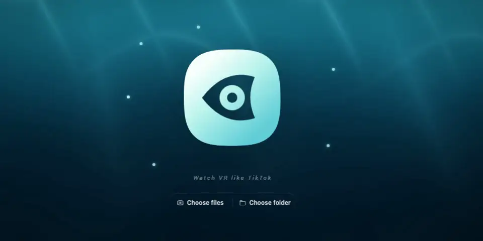

# Foursmith VR

<div align="center">
  <picture>
    <source media="(prefers-reduced-motion: reduce)" srcset="doc/banner.jpg">
    
  </picture>
  <p><strong><em>Watch VR like TikTok</em></strong></p>
  <p><em>This might be the most enjoyable way to experience VR — no headset required, and no worries if you suffer from motion sickness. Sit back and enjoy!</em></p>
  <p><a href="https://vr.foursmith.com/"><strong>Open Foursmith VR →</strong></a></p>
</div>

## Features

- **Enjoy VR without a headset.** Turn immersive video into a comfortable, easy-to-follow 2D view and simply sit back and watch.
- **Let the camera follow the action.** Automatic framing and portrait centering keep detected faces comfortably in view.
- **Make wide screens work for people.** Portrait layout repeats the view in portrait panels, keeping human subjects large and easy to see.
- **Play the formats you already have.** Open 180°, 360°, side-by-side, top-bottom, fisheye, and flat videos directly in the browser.
- **Bring your whole library.** Choose local files or folders, run the included media server, and discover videos from DLNA devices.
- **Save exactly what you see.** Mark an A–B range and export a WebM, MP4, or single-file Motion Photo from the current view, complete with visible subtitles in supported browsers.
- **Bring subtitles along.** Matching subtitle files are paired automatically, with support for browser-based live speech translation workflows.
- **Stay in control.** Use the mouse, keyboard shortcuts, or polished on-screen controls—Foursmith VR is free and open source.

## Usage

> [!Important]
> Most 8K VR videos may not play properly or smoothly in Safari or Firefox. All browsers on iOS are Safari under the hood.

For the best experience, use Chrome, Edge, or another Chromium-based desktop browser.

### Keyboard Shortcuts

| Shortcut | Action |
| --- | --- |
| Space / K | Play or pause |
| Left / J | Seek backward 10 seconds |
| Right / L | Seek forward 10 seconds |
| Shift + Left / Shift + J | Seek backward 60 seconds |
| Shift + Right / Shift + L | Seek forward 60 seconds |
| Up / Down | Adjust volume |
| M | Mute or unmute |
| F | Toggle fullscreen |
| R | Reset view and zoom |
| [ / - | Zoom out |
| ] / = | Zoom in |
| 1-7 | Select projection |
| , / . | Previous or next quality preset |

## Deployment

[](https://deploy.workers.cloudflare.com/?url=https://github.com/foursmith/vr)
[](https://vercel.com/new/clone?repository-url=https%3A%2F%2Fgithub.com%2Ffoursmith%2Fvr&root-directory=.)

## Local media server

Docker is the recommended way to run the local media server. It serves the complete Web UI, exposes local media directories, and supports DLNA discovery.

### Docker Compose

Copy the environment example, set `FSVR_MEDIA_DIR` to the directory or mounted disk containing your media, and start the service:

```sh
cp .env.example .env
docker compose up -d
docker compose logs fsvr
```

Open `http://localhost:4090` and use the password printed by `docker compose logs fsvr`. The media directory is mounted read-only. On macOS, an external disk path typically looks like `/Volumes/Media/Movies`; on Linux, it might be `/mnt/media`.

Use `docker compose up -d --build` to build the image from the current source instead of using the published image.

### Docker run

To start the published image directly with `~/Movies`:

```sh
docker run --rm -p 4090:4090 -v "$HOME/Movies:/media:ro" ghcr.io/foursmith/vr:latest
```

The generated access password is printed in the container logs. Add `--disable-password` after the image name to disable authentication, or `--password <password>` to set a stable password.

Release tags matching `v*` publish multi-architecture Docker images to `ghcr.io/foursmith/vr` and create a GitHub Release with an automatically generated changelog.

## Development

### Technology stack

| Area | Technology |
| --- | --- |
| Web UI | SolidJS 2 beta, TypeScript |
| Build and PWA | Vite, Vite PWA |
| VR rendering | Three.js |
| Face tracking | MediaPipe Tasks Vision |
| Styling and icons | UnoCSS with `presetWind3()`, Iconify |
| Local media server | Bun, Citty |
| Testing | Vitest, Playwright |

### Getting started

Requires [Bun](https://bun.sh/). Install dependencies and start the Web app:

```sh
bun install
bun run dev
```

To develop the Web app and local media server together, pass a media directory:

```sh
bun run dev:cli -- ~/Movies
```

Both commands support hot reloading. The media server development command opens `http://127.0.0.1:4090` and disables authentication.

Run checks and production builds:

```sh
bun run typecheck
bun run test
bun run build
bun run typecheck:cli
bun run test:cli
bun run build:cli
```

## Contributing

Bug reports, feature requests, and pull requests are welcome. Please use [GitHub Issues](https://github.com/foursmith/vr/issues) to discuss bugs or larger changes before implementation.

1. Fork the repository and create a focused branch.
2. Make your changes and add or update tests where appropriate.
3. Run `bun run lint`, `bun run typecheck`, and `bun run test`. For CLI changes, also run `bun run typecheck:cli` and `bun run test:cli`.
4. Use a [Conventional Commit](https://www.conventionalcommits.org/) message, for example `fix(player): correct projection reset`.
5. Open a pull request describing the change and how it was tested.

When changing the Web UI, follow the project's [SolidJS 2 migration guide](doc/MIGRATION.md) and existing UnoCSS Wind3 conventions. Changes to face detection, tracking, or centering algorithms must also keep the [portrait centering reference](doc/PORTRAIT_CENTERING.md) synchronized.

## License

Foursmith VR is licensed under the [Mozilla Public License 2.0](LICENSE). Code by GPT 5.6 Sol. Taste by me.