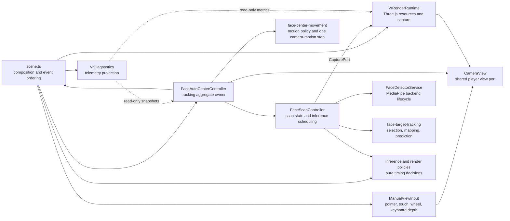
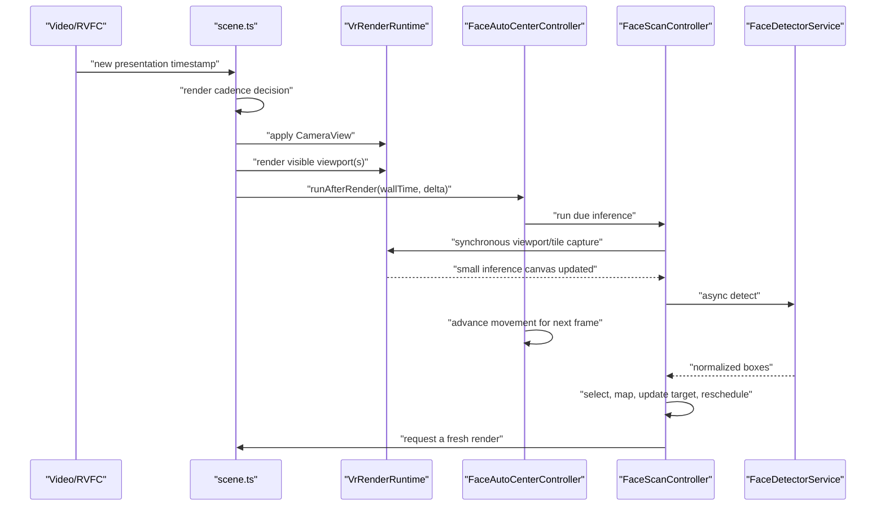

# VR Runtime Architecture

This document defines the runtime boundaries of the VR player. The goal is to keep rendering, input, scanning, detection, movement, and diagnostics independently understandable while preserving the frame-order guarantees required by WebGL readback and portrait centering.

## Dependency flow

Dependencies point inward toward small policies and ports. In particular, rendering does not import tracking, the detector service does not own canvases, and diagnostics cannot reset business state.

## Module ownership

| Module | Owns | Must not own |
| --- | --- | --- |
| `scene.ts` | module construction, media/visibility listener ordering, RAF/RVFC handoff, public controller lifecycle, lightweight movement-hint DOM projection | face-detection state, detector backend, Three.js resource details, gestures, movement math, metric aggregation |
| `config.ts` | projection and quality options, camera-view contract, render-quality calculation | Three.js resources or runtime state |
| `rendering/projection.ts` | projection geometry, UV mapping, materials, and disposal | renderer lifecycle, viewport layout, tracking |
| `rendering/vr-player-renderer.ts` | Three.js scene, camera, renderer, video texture, projection replacement, sizing, and disposal | split-screen layout, inference capture, tracking |
| `rendering/vr-render-runtime.ts` | renderer composition, output canvas, viewport layout, split rendering, GPU capture transaction, and inference readback | scan order, target selection, inference timing, manual override |
| `control/manual-view-input.ts` | pointer capture, drag, touch/pinch state, wheel normalization, input listener cleanup | face state, detector state, pause timers, render implementation |
| `tracking/face-auto-center-controller.ts` | the `FaceAutoCenterState` aggregate, manual override timer, tracking lifecycle, scanner/detector composition | DOM element lookup, media listeners, RAF/RVFC ownership |
| `tracking/face-scan-controller.ts` | `FaceDetectionState`, inference canvas, inference generation, adaptive inference measurements, panorama pass progress | visible renderer internals, camera movement, media listener registration |
| `detection/protocol.ts` | normalized face, inference, and worker message contracts | scan state or camera policy |
| `detection/face-tracker-client.ts` and `face-detector-worker.ts` | MediaPipe resources, worker/fallback selection, inference transport | scan order, camera movement, target selection |
| `detection/mediapipe-client.ts` and `face-detector-service.ts` | detector adapter and detector-generation lifecycle | inference generation, canvases, scan state |
| `tracking/face-center-movement.ts` | centering constraints and velocity policy plus one synchronous movement transition over the tracking aggregate and view | timers, scanning, detector calls, DOM |
| `tracking/face-detection-state.ts` | viewport/recovery transitions and panorama recovery progress | detector calls, rendering, camera movement |
| `tracking/face-sampling.ts` and `face-target-tracking.ts` | panorama scan geometry, coordinate mapping, target selection, and motion prediction | detector lifecycle, DOM, render scheduling |
| `tracking/inference-schedule-policy.ts` and `rendering/render-cadence-policy.ts` | pure inference and rendering cadence decisions | timers, controller state, side effects |
| `vr-diagnostics.ts` | counters, rolling samples, long-task observer, text formatting, debug panel output | cadence clocks, latest scheduling inference cost, tracking state mutation |

`CameraView` remains a compatibility port shared with the player controller. Manual input and automatic movement are the only VR-side writers; rendering and diagnostics only read it. A future replacement may expose command-based manual/automatic mutations, but consumers must not add another direct writer.

## Visible-frame and inference order

The order below is an invariant, not an implementation detail:

The visible view must render before viewport capture. Automatic movement is applied afterward for the next frame, otherwise detected pixels and the camera pose used for coordinate mapping would describe different views.

Panorama recovery capture is atomic inside `VrRenderRuntime`:

1. save the visible camera;
2. move the camera to the projection center and render one perspective tile;
3. synchronously copy the tile into the inference canvas;
4. restore the camera in `finally`;
5. redraw the visible viewport or split viewports.

Tracking never manipulates the renderer directly; it only calls the capture port.

## Clock and generation separation

Three independent concepts must remain separate:

- Presentation time comes from `requestVideoFrameCallback` and is used only for playback frame limiting.
- Wall time comes from RAF/performance and drives camera motion, retry deadlines, target ages, and inference timestamps.
- Detector generation invalidates a backend that is loading or being released, while inference generation rejects a result made obsolete by pause, projection, visibility, or media changes.

Combining either pair creates stale-result or cadence bugs.

## Reset ordering

Cross-module reset order stays in `scene.ts` because a media reset affects several owners:

1. invalidate/reset auto-centering and its inference state;
2. stop scheduled rendering and clear the pending presentation timestamp;
3. reset diagnostics;
4. reset renderer media resources.

Destroy follows the same direction: stop producers, remove listeners, destroy input and tracking controllers, then release rendering resources. Each module's `destroy()` is responsible only for resources it owns.

## Import boundaries

Runtime code and tests import the focused owner directly. There are no compatibility re-export facades: movement, target tracking, inference cadence, render cadence, and render capture each have one canonical module.
